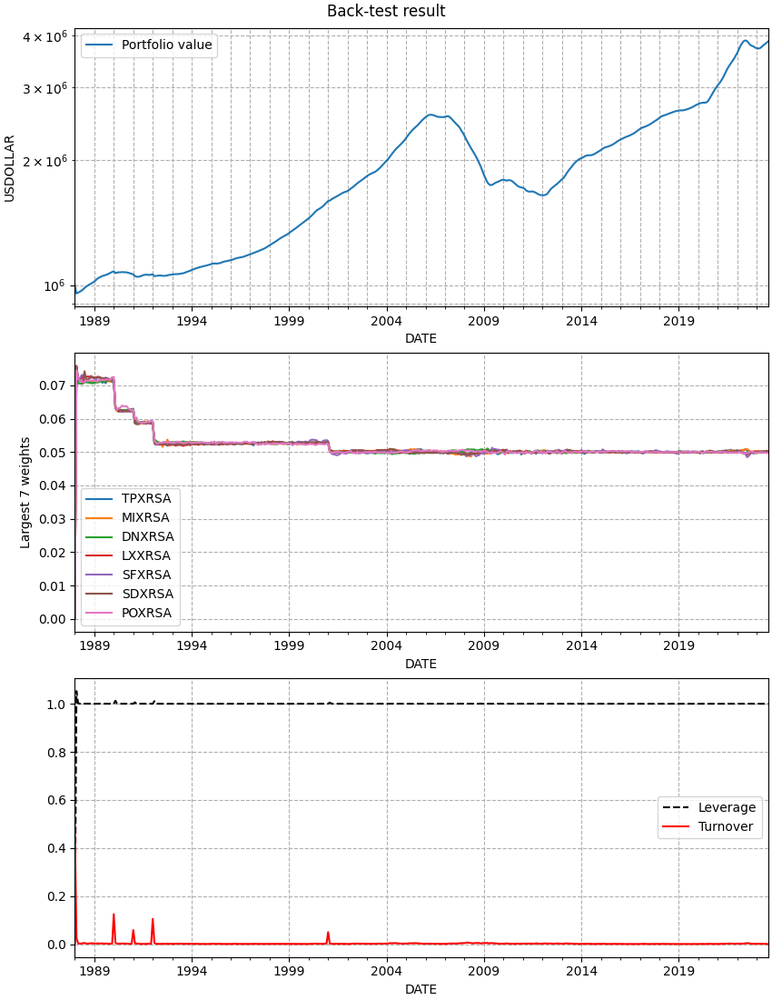
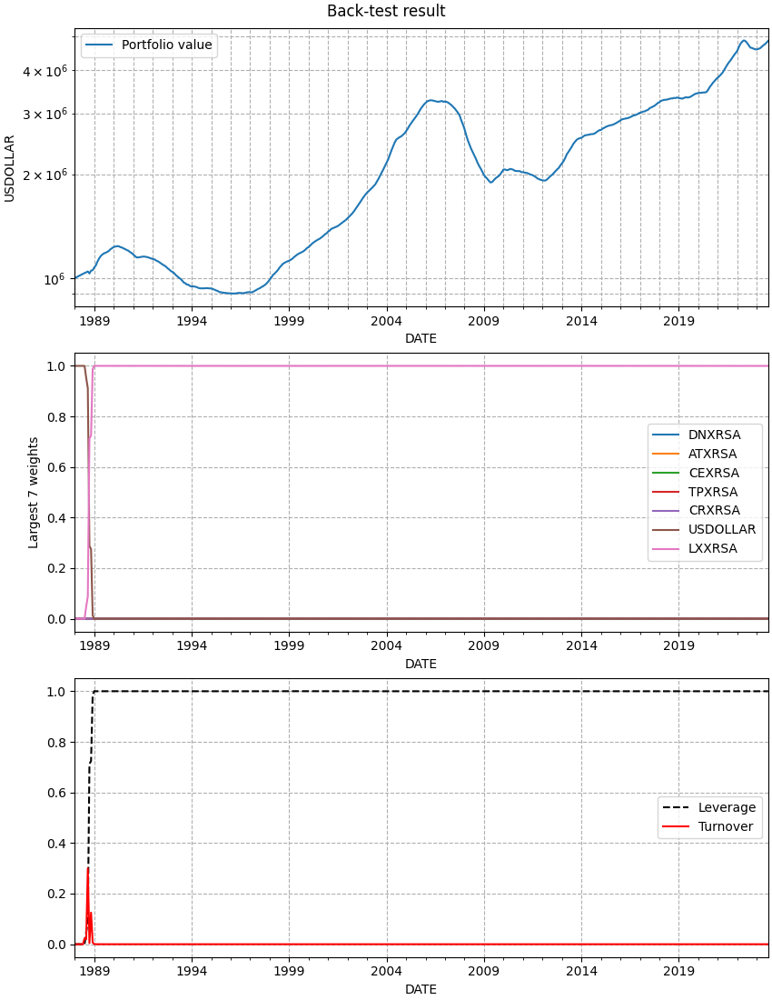

Case-Shiller multi-period
=========================

This is an example that shows that Cvxportfolio can work as well with
different asset classes, in this case a real estate portfolio. We use
the Case-Shiller index as proxy for the price of housing units in various
metropolitan areas in the USA. We impose realistic transaction costs, which
are comparable to the annual return on the asset, and we show
that multi-period optimization is useful to correctly balance transaction cost
and expected risk-adjusted return.
This example script is
`available in the repository 
<https://github.com/cvxgrp/cvxportfolio/blob/master/examples/case_shiller.py>`_.

.. literalinclude:: ../../examples/case_shiller.py
   :language: python
   :lines: 14-

This is the output printed to screen when executing this script. You can see
many statistics of the back-tests.

.. include:: ../_static/case_shiller_output.txt
   :literal:

And these are the figure that are plotted. 
The result of the :class:`cvxportfolio.Uniform` policy, which allocates equal
weight to all non-cash assets:

   This figure is made by the :meth:`plot()` method of :class:`cvxportfolio.BacktestResult`

And result of the :class:`cvxportfolio.MultiPeriodOptimization` policy, selected
among the efficient frontier below as the one with highest back-tested profit:

   This figure is made by the :meth:`plot()` method of :class:`cvxportfolio.BacktestResult`

And finally, the efficient frontier, which shows that the 
:class:`cvxportfolio.MultiPeriodOptimization` policies out-perform the
:class:`cvxportfolio.Uniform` allocation in both risk and reward, including
the transaction costs.

  .. figure:: ../_static/case_shiller_frontier.png
     :scale: 100 %
     :alt: hello_world.py result figure

     Efficient frontier of back-test results, which include transaction costs.
