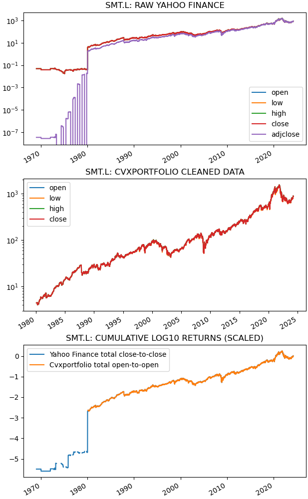
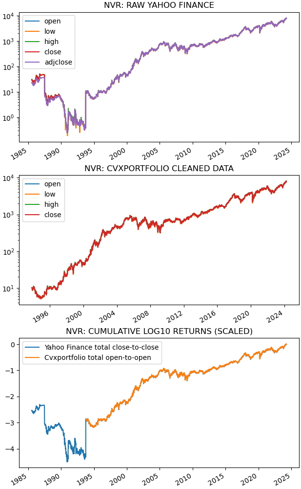
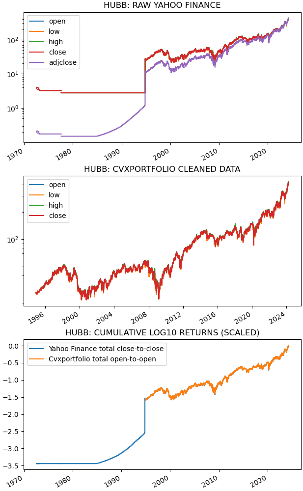
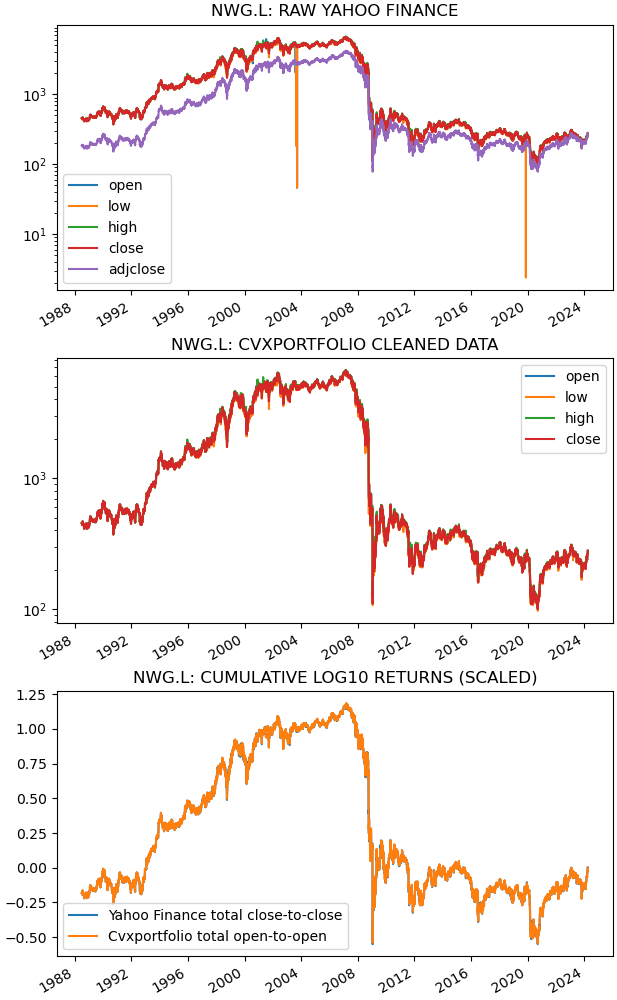
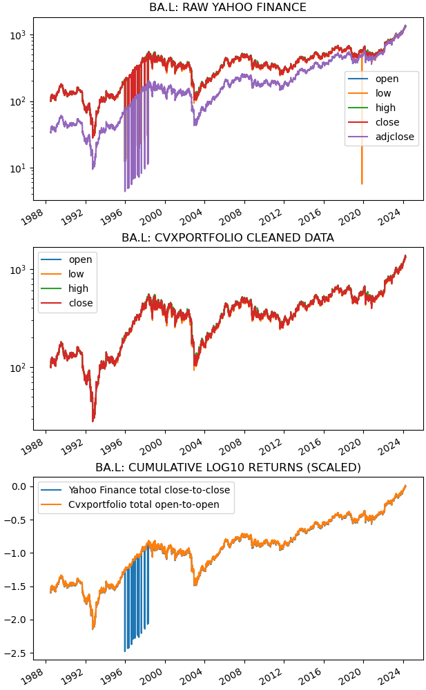

.. Copyright (C) 2023-2024 Enzo Busseti

.. This file is part of Cvxportfolio.

.. Cvxportfolio is free software: you can redistribute it and/or modify it under
.. the terms of the GNU General Public License as published by the Free Software
.. Foundation, either version 3 of the License, or (at your option) any later
.. version.

.. Cvxportfolio is distributed in the hope that it will be useful, but WITHOUT
.. ANY WARRANTY; without even the implied warranty of MERCHANTABILITY or FITNESS
.. FOR A PARTICULAR PURPOSE. See the GNU General Public License for more
.. details.

.. You should have received a copy of the GNU General Public License along with
.. Cvxportfolio. If not, see <https://www.gnu.org/licenses/>.

Data cleaning
=============

.. automodule:: examples.data_cleaning

.. literalinclude:: ../../examples/data_cleaning.py
   :language: python
   :start-after: if __name__ ==
   :end-before: # we use this to save the plots
   :dedent:

This is the output printed to screen when executing this script. You can see
many diagnostics of the data cleaning. Scroll down to the pictures to see
what is actually going on.

.. literalinclude:: ../_static/data_cleaning_output.txt
   :language: text

And these are the figure that are plotted. For each of the test stocks, we
see the original Yahoo Finance data, which has many issues, and the cleaned
data that is produced, and used, by Cvxportfolio.

Data cleaning process for stock ``'SMT.L'``:

Data cleaning process for stock ``'NVR'``:

Data cleaning process for stock ``'HUBB'``:

Data cleaning process for stock ``'NWG.L'``:

Data cleaning process for stock ``'BA.L'``:

