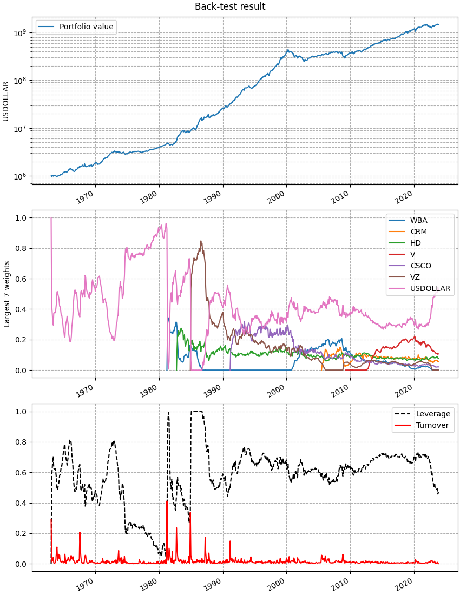
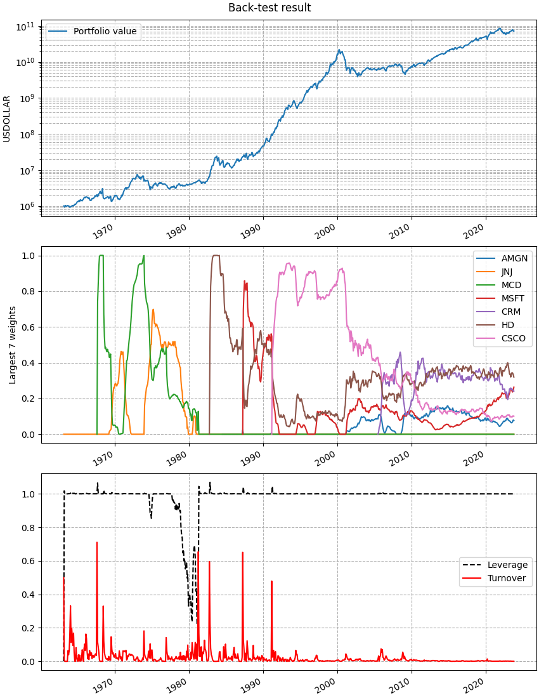
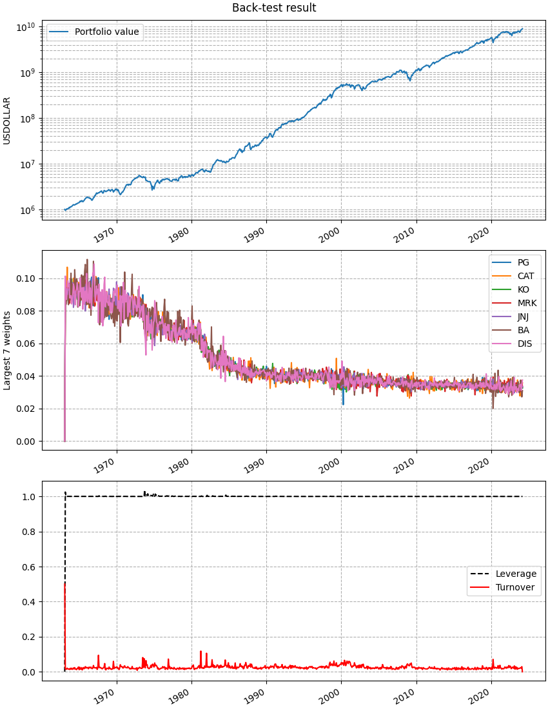
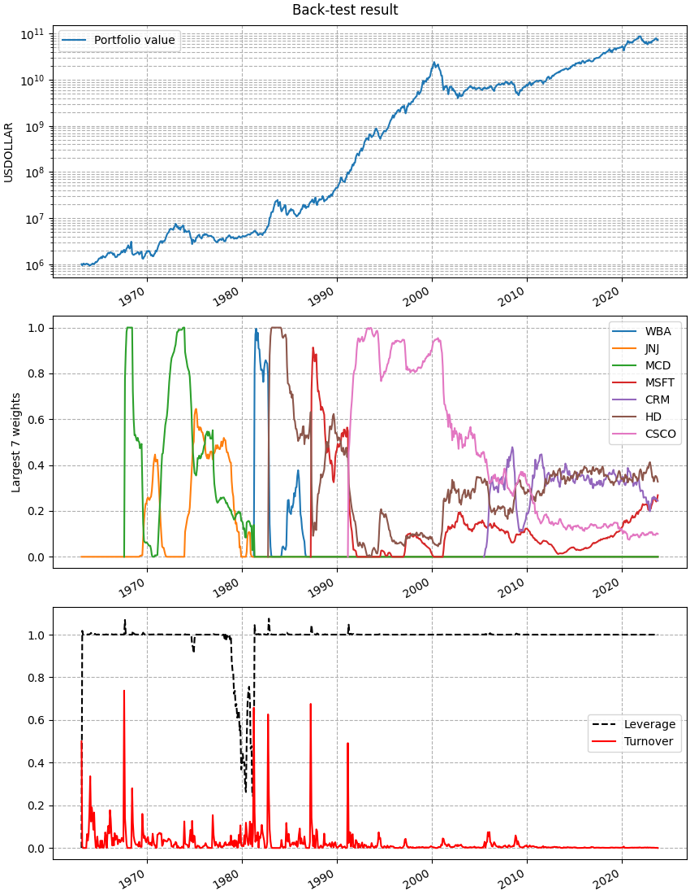

DOW30 monthly
=============

This example script is
`available in the repository <https://github.com/cvxgrp/cvxportfolio/blob/master/examples/dow30.py>`_.
See the docstring below for its explanation.

.. literalinclude:: ../../examples/dow30.py
   :language: python
   :lines: 14-

This is the output printed to screen when executing this script. You can see
many statistics of the back-tests.

.. include:: ../_static/dow30_example_output.txt
   :literal:

And these are the figure that are plotted. 
The result of the :class:`cvxportfolio.MultiPeriodOptimization` policy
that has the largest out-of-sample Sharpe ratio:

   This figure is made by the :meth:`plot()` method of :class:`cvxportfolio.BacktestResult`
   
The result of the :class:`cvxportfolio.MultiPeriodOptimization` policy
that has the largest out-of-sample growth rate:

   This figure is made by the :meth:`plot()` method of :class:`cvxportfolio.BacktestResult`

The result of the :class:`cvxportfolio.Uniform` policy, which allocates equal
weight to all non-cash assets:

   This figure is made by the :meth:`plot()` method of :class:`cvxportfolio.BacktestResult`

Finally, the result of the :class:`cvxportfolio.MultiPeriodOptimization` policy
obtained by automatic hyper-parameter optimization to have largest profit:

   This figure is made by the :meth:`plot()` method of :class:`cvxportfolio.BacktestResult`
