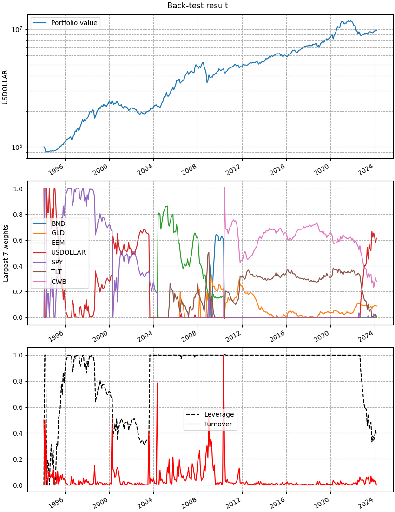

.. Copyright (C) 2023-2024 Enzo Busseti

.. This file is part of Cvxportfolio.

.. Cvxportfolio is free software: you can redistribute it and/or modify it under
.. the terms of the GNU General Public License as published by the Free Software
.. Foundation, either version 3 of the License, or (at your option) any later
.. version.

.. Cvxportfolio is distributed in the hope that it will be useful, but WITHOUT
.. ANY WARRANTY; without even the implied warranty of MERCHANTABILITY or FITNESS
.. FOR A PARTICULAR PURPOSE. See the GNU General Public License for more
.. details.

.. You should have received a copy of the GNU General Public License along with
.. Cvxportfolio. If not, see <https://www.gnu.org/licenses/>.

Wide asset classes ETFs
=======================

.. automodule:: examples.etfs

.. literalinclude:: ../../examples/etfs.py
   :language: python
   :start-after: if __name__ ==
   :end-before: # we use this to save the plots
   :dedent:

This is the output printed to screen when executing this script. You can see
many statistics of the back-tests.

.. literalinclude:: ../_static/etfs_output.txt
   :language: text

And these are the figure that are plotted.
The result of the :class:`cvxportfolio.MultiPeriodOptimization` policy
that has the largest out-of-sample Sharpe ratio:

.. figure:: ../_static/etfs_largest_sharpe_ratio.png
   :scale: 100 %
   :alt: examples/etfs.py result figure

   This figure is made by the :meth:`cvxportfolio.result.BacktestResult.plot` method.

The result of the :class:`cvxportfolio.MultiPeriodOptimization` policy
that has the largest out-of-sample growth rate:

   This figure is made by the :meth:`cvxportfolio.result.BacktestResult.plot` method.
