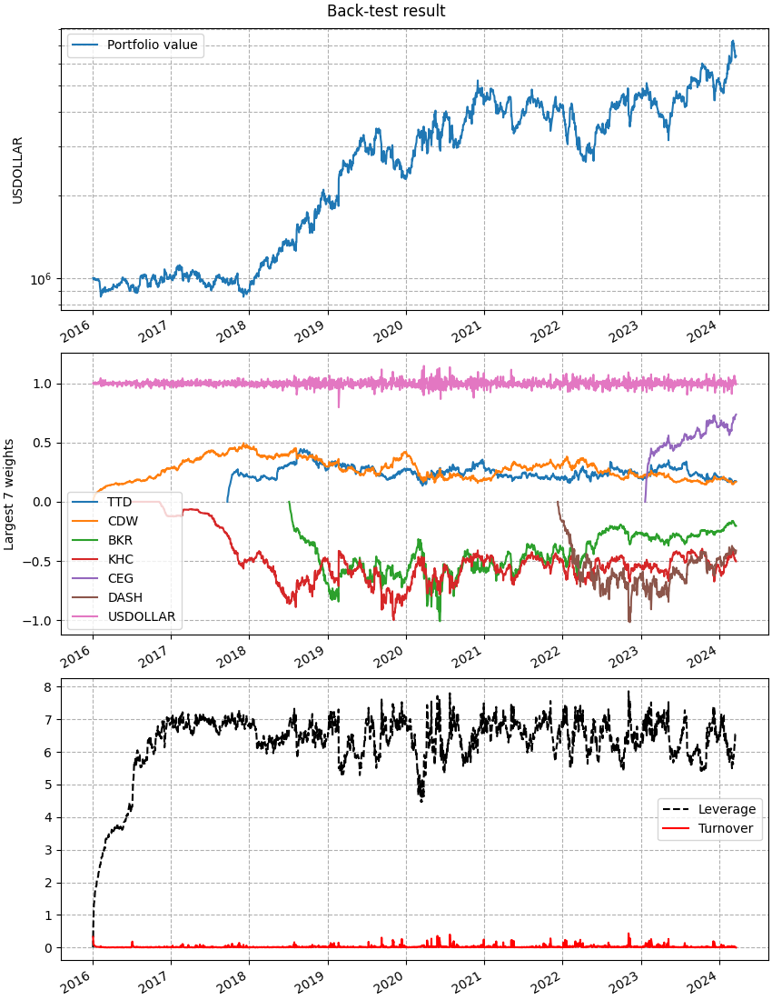

Market-Neutral Portfolio
=========================

.. automodule:: examples.market_neutral

.. literalinclude:: ../../examples/market_neutral.py
   :language: python
   :start-after: if __name__ ==
   :end-before: # we use this to save the plots
   :dedent:

This is the output printed to screen when executing this script. You can see
the steadly increasing Sharpe ratio during the hyper-parameter optimization
loop; at each iteration, small changes in hyper-parameter values are tried
and the combination with largest increase is chosen (the routine ends when
no increase is found). Finally, the optimized policy is printed.
When you do so, you can observe the values of all parameters that are contained
in the policy object and its components, including many that were set to their
defaults, in this case. Finally, you can see that the resulting strategy
back-tested returns have low correlation with the market benchmark,
thanks to the :class:`cvxportfolio.constraints.MarketNeutral` constraint.

.. literalinclude:: ../_static/market_neutral_output.txt

And this is the figure that is plotted, the result of hyper-parameter
optimization with largest Sharpe ratio.

   This figure is made by the :meth:`cvxportfolio.result.BacktestResult.plot` method.
