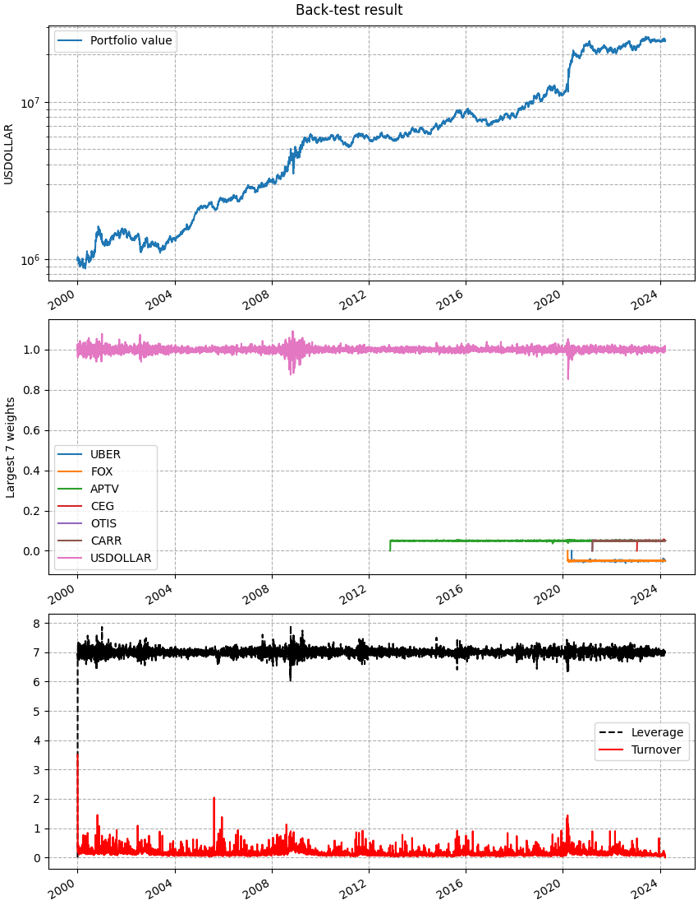

Market-Neutral Portfolio (Without Costs)
========================================

.. automodule:: examples.market_neutral_nocosts

.. literalinclude:: ../../examples/market_neutral_nocosts.py
   :language: python
   :start-after: if __name__ ==
   :end-before: # we use this to save the plots
   :dedent:

This is the output printed to screen when executing this script.

.. literalinclude:: ../_static/market_neutral_nocosts_output.txt

And this is the figure that is plotted.

   This figure is made by the :meth:`cvxportfolio.result.BacktestResult.plot`
   method.