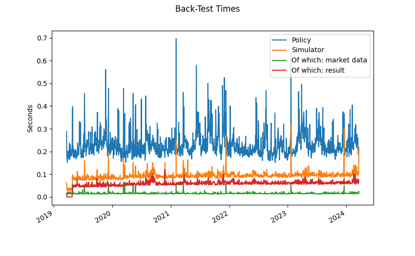
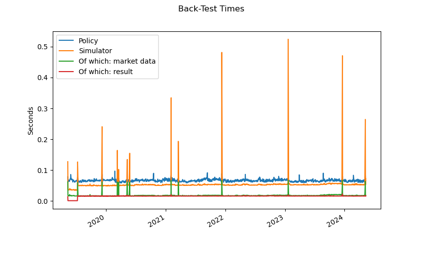

Timing of Back-Test
===================

.. automodule:: examples.timing

.. literalinclude:: ../../examples/timing.py
   :language: python
   :start-after: if __name__ ==
   :end-before: # we use this to save the plots
   :dedent:

This is the output printed to screen when executing this script. You can see
the difference in timing between the two runs (all other statistics are
identical) because in the first run covariance matrices are estimated and
saved on disk, and the second time they are loaded. You can also see that
the time accounting done by :class:`cvxportfolio.simulator.MarketSimulator`
is very accurate, and coincides (with a tiny difference) with what is reported
by Python's ``time`` here in the script.

.. literalinclude:: ../_static/timing_output.txt
   :language: text

And these are the figures that are plotted. The first run, with longer
time spent in the policy (which does the covariance estimation,
in the :class:`cvxportfolio.forecast.HistoricalFactorizedCovariance`
object).

   This figure is made by the :meth:`cvxportfolio.result.BacktestResult.times_plot` method.

And the second run, when covariances are loaded from disk. The time taken
to load them is accounted for in the simulator times (there are a few spikes
there, saved covariances are loaded at each change of universe).

   This figure is made by the :meth:`cvxportfolio.result.BacktestResult.times_plot` method.

