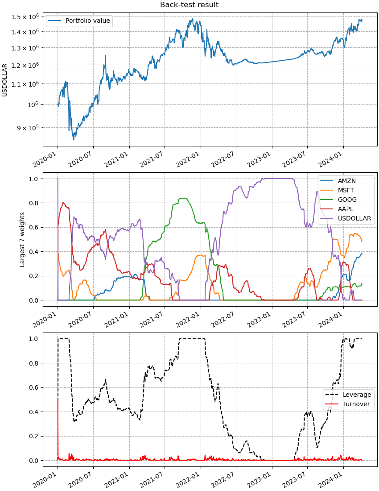

.. Copyright (C) 2023-2024 Enzo Busseti

.. This file is part of Cvxportfolio.

.. Cvxportfolio is free software: you can redistribute it and/or modify it under
.. the terms of the GNU General Public License as published by the Free Software
.. Foundation, either version 3 of the License, or (at your option) any later
.. version.

.. Cvxportfolio is distributed in the hope that it will be useful, but WITHOUT
.. ANY WARRANTY; without even the implied warranty of MERCHANTABILITY or FITNESS
.. FOR A PARTICULAR PURPOSE. See the GNU General Public License for more
.. details.

.. You should have received a copy of the GNU General Public License along with
.. Cvxportfolio. If not, see <https://www.gnu.org/licenses/>.

User-provided forecasters
=========================

.. automodule:: examples.user_provided_forecasters

.. literalinclude:: ../../examples/user_provided_forecasters.py
   :language: python
   :start-after: if __name__ ==
   :end-before: # we use this to save the plots
   :dedent:

This is the output printed to screen when executing this script. If you compare
to a back-test using the standard Cvxportfolio forecasters you may notice
that the default have faster execution time (that's shown in the policy times).
That is because Cvxportfolio built-in :doc:`forecasters <../forecasts>` are
optimized for sequential evaluation, at each point in time of a back-test they
don't necessarily compute the forecasts from scratch, but update the ones
computed at the period before (if possible).

.. literalinclude:: ../_static/user_provided_forecasters_output.txt
   :language: text

And this is the figure that is plotted. You can see that, compared to the
standard Cvxportfolio forecasts (which use all available historical data at
each point in time) this back-test has a much less stable allocation, and
changes much more with the market conditions.

   This figure is made by the :meth:`cvxportfolio.result.BacktestResult.plot` method.
